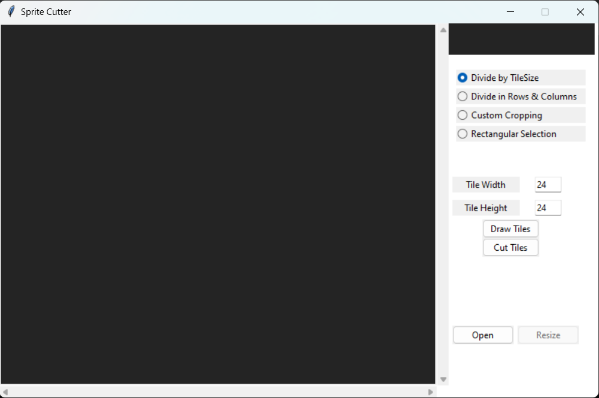
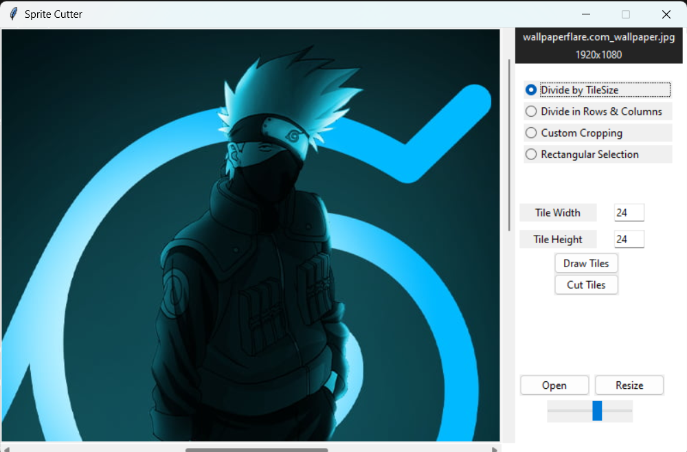

# **Image Editor**

<p align = "center"></p>

Image Editor - is a simple python tkinter based application to cut, crop, resize and divide images in equal parts

# Python Version

## Python 3

# Dependencies

- Pillow

    ```
    pip install pillow
    ```

# Set-Up ⚒️

<p align = "center"></p>

- Ensure you have the latest stable version of [Python 3](https://www.python.org/downloads/) in your system

- Open your terminal / command prompt

- Clone the repository 
    ```
    git clone https://github.com/Julian-Idl/Image-Editor.git
    ```
- Change the directory to the cloned project
    
    ```
    cd Image-Editor
    ```

# Usage

- Run the following command in terminal / command prompt
  
    ```
    python main.py
    ```

### Currently you can divide the images by following 4 mechanisms

- By tile size - divides the image in number of tiles of equal size
- By rows & Columns - divides the image in given number of rows and columns
- By custom coordinates - divides or crops the image based on the coordinates provided.
- By Rectangle - extension of cropping based on custom cordinates. To use this features select anywhere on the image to start selecting the rectangular part.

# Demo 👇

**v.0.0.1 (Graphical User Interface Default Preview)**


<p align = "center"></p>


**v.0.0.1 (Graphical User Interface With A Song Playing)**

<p align = "center"></p>

# Note ✏️

- Feel free to contact me in my  [](https://julian-idl.codes)

# Author ❤️

Made with ❤️ by [`Julian-Idl`](https://julian-idl.codes) 